# 🔴 Hotstuff MM Bot



> Automated market making bot for [Hotstuff.trade](https://app.hotstuff.trade/join/hot) — earns maker rebates on BTC-PERP & ETH-PERP 24/7.

```
╔══════════════════════════════════════════════════════╗
║  Vol/day ~$550K  │  Maker 100%  │  Rebate $10-30/day ║
╚══════════════════════════════════════════════════════╝
```

---

## How It Works

Places post-only limit orders on both sides of the orderbook every 5 seconds:

```
   BID $199.94  ◄──── 3bps spread ────►  ASK $200.06
        ↑                                      ↑
   [BOT ORDER]        MID $200.00         [BOT ORDER]
        │                                      │
   fill → earn rebate 0.002%~0.005%       fill → earn rebate
```

**Inventory skew** automatically shifts quotes when position builds up:

```
  Position SHORT $1200 (50%):
    BID shifts UP  → BUY fills more likely → position shrinks ✅
    ASK shifts UP  → SELL fills less likely → no more shorts ✅
```

---

## Features

| Feature | Description |
|---------|-------------|
| ✅ 100% maker fills | `po=True` post-only — zero taker fees |
| ✅ Inventory skew | Prevents position buildup in trending markets |
| ✅ Adaptive spread | Auto-widens during high volatility |
| ✅ Directional cap | BTC+ETH combined net exposure limited |
| ✅ Telegram alerts | Hourly reports, halt alerts, circuit breaker |
| ✅ Auto close on halt | Market order closes all positions on stop |
| ✅ Startup sync | Retries position sync before first order |
| ✅ Fill dedup | Persisted to disk, survives restarts |

---

## Live Results

| Session | Spread | Skew | Volume | Maker% | Net |
|---------|--------|------|--------|--------|-----|
| Session 1 | 5bps | 0.5 | $444K/day | 100% | -$14/2h ⚠️ |
| Session 2 | 3bps | 0.5 | $614K/day | 100% | -$14/90m ⚠️ |
| **Session 3** | **3bps** | **1.5** | **$541K/day** | **99.1%** | **-$2.8/2h ✅** |

Inventory skew 0.5→1.5 reduced losses by **85%** in trending conditions.

---

## Telegram Reports

```
📊 Hourly Report (uptime 3.0h)

💰 PnL & Rebate
  Daily rebate:    +$12.34
  Daily loss:      -$0.80
  Net today:       +$11.54
  Projection:      +$277/day

📈 Volume & Tier
  Daily vol:   $541,000
  Fills:       1,624
  🏆 Standard → VIP1 in 18.5 days

📍 Positions
  BTC-PERP: SHORT 📉 $256
  [███░░░░░░░] 11% / $2400
  ETH-PERP: FLAT ➡️ $0
  Directional: -$256 / ±$2400

⚠️ Risk
  Daily loss: $0.80/$30  [░░░░░░░░] 3% 🟩
  Unrealized: +$0.02/-$50 [░░░░░░░░] 0% 🟩
```

---

## Quickstart

### 1. Clone & install

```bash
git clone https://github.com/omgmad/hotstuffmm
cd hotstuffmm
pip install -r requirements.txt
```

### 2. Setup agent wallet

On Hotstuff: **Settings → API → Create Agent Wallet**
Copy the agent wallet address and private key.

### 3. Configure

```bash
cp .env.example .env
nano .env
```

```env
PRIVATE_KEY=0x_your_agent_wallet_private_key
WALLET_ADDRESS=0x_your_agent_wallet_address

# Optional — Telegram alerts
TELEGRAM_TOKEN=1234567890:ABCdef...   # @BotFather → /newbot
TELEGRAM_CHAT_ID=123456789            # @userinfobot → /start
```

### 4. Run

```bash
python hotstuff_mm_bot.py
```

```
╔══════════════════════════════════════════════════════╗
║   🔴  HOTSTUFF MAINNET MM Bot v4.0                   ║
║   ⚠️  Real money on mainnet. Start small!             ║
╚══════════════════════════════════════════════════════╝

Confirm to start [yes/no]: yes
🚀 Market making started...
```

---

## Configuration

```python
# hotstuff_mm_bot.py — CONFIG section

"order_size_usd":            200,   # $ per order
"max_position_usd":         2400,   # max per symbol
"max_total_exposure_usd":   4800,   # BTC+ETH total
"max_net_directional_usd":  2400,   # one-sided cap
"daily_loss_limit_usd":     30.0,   # halt threshold
"unrealized_loss_limit_usd": 50.0,  # force-close threshold
"consecutive_loss_limit":      3,   # circuit breaker
"circuit_breaker_pause_sec": 900,   # 15 min pause
"spread_bps":                3.0,   # base spread
"spread_min_bps":              3,   # min spread
"spread_max_bps":              5,   # max (volatile)
"inventory_skew_factor":     1.5,   # skew strength
"refresh_interval":            5,   # seconds/cycle
"symbols": ["BTC-PERP", "ETH-PERP"],
```

---

## Risk Management

```
Daily loss $30 hit ──────────────► HALT + close all positions
                                         │
Unrealized < -$50 ───────────────► market close all
                                         │
3 consecutive losses ────────────► 15 min pause (circuit breaker)
                                         │
Net directional > $2400 ─────────► block new orders that side
                                         │
Per-symbol position > $2400 ─────► block that side only
```

All halt events send Telegram alert with next steps.

---

## Rebate Tiers

| Tier | 14D Volume | Rebate | Days to reach* |
|------|-----------|--------|---------------|
| Standard | — | 0.0020% | Now |
| VIP 1 | $10M | 0.0025% | ~18 days |
| VIP 2 | $25M | 0.0030% | ~45 days |
| VIP 3 | $50M | 0.0035% | ~90 days |
| VIP 4 | $100M | 0.0050% | ~180 days |

*Based on ~$550K/day volume

| Tier | Rebate/day | Rebate/month |
|------|-----------|-------------|
| Standard | $11 | $330 |
| VIP 1 | $14 | $414 |
| VIP 4 | $28 | $829 |

---

## Requirements

- Python 3.10+
- Hotstuff account with agent wallet
- $300+ USDC (more = safer liquidation distance)
- Always-on server/VPS for 24/7 operation

---

## ⚠️ Disclaimer

This bot trades real money on mainnet. Use at your own risk. Start small and monitor. The authors are not responsible for any losses.

---

## Links

🔴 **Trade on Hotstuff** → [app.hotstuff.trade/join/hot](https://app.hotstuff.trade/join/hot)
&nbsp;&nbsp;&nbsp;*(Use referral to support this project)*

🐦 **Twitter/X** → [@omgmad](https://x.com/omgmad)

💻 **GitHub** → [github.com/omgmad](https://github.com/omgmad)

---

*Star ⭐ the repo if this helps you!*
